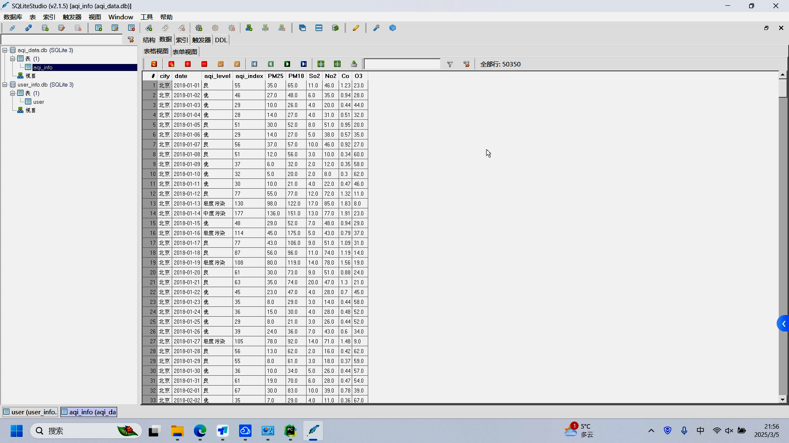
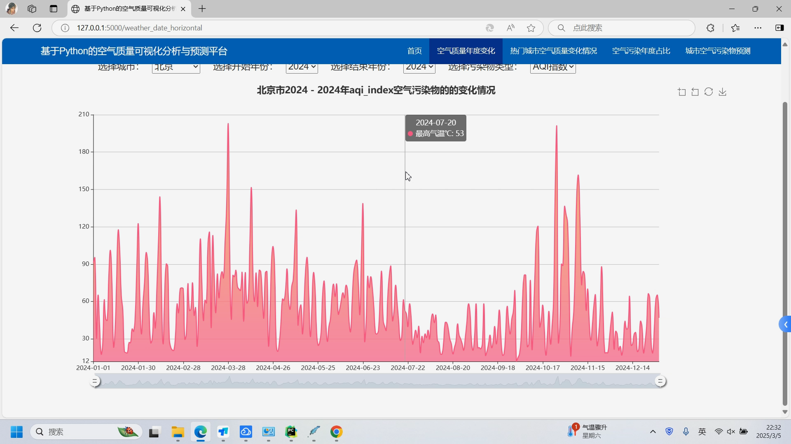
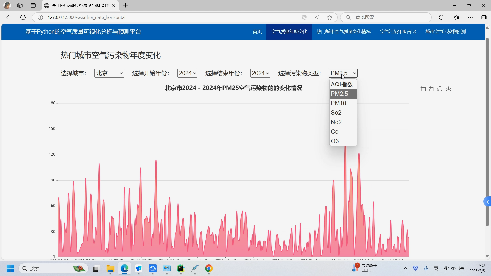
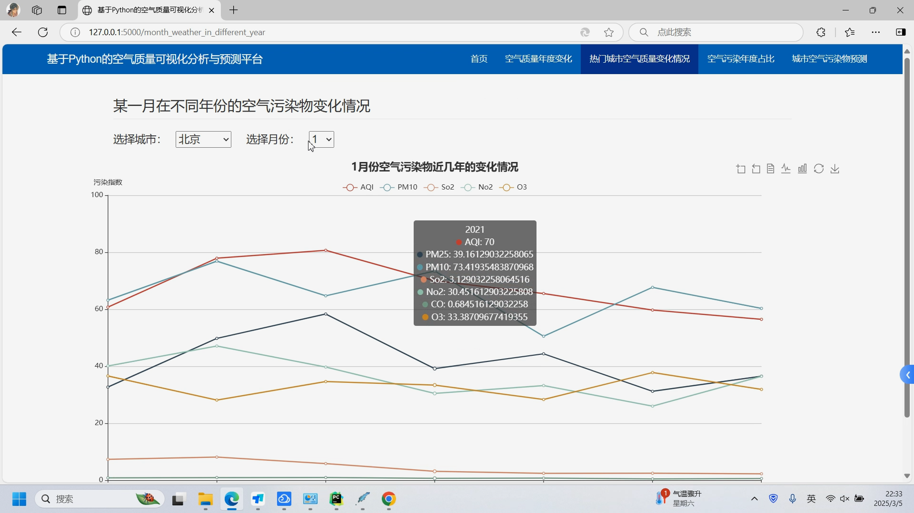
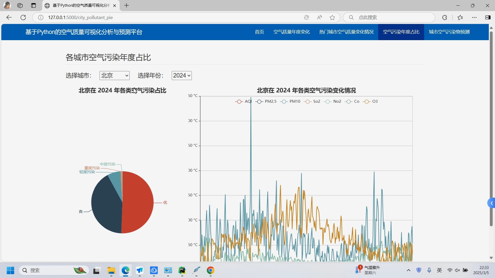
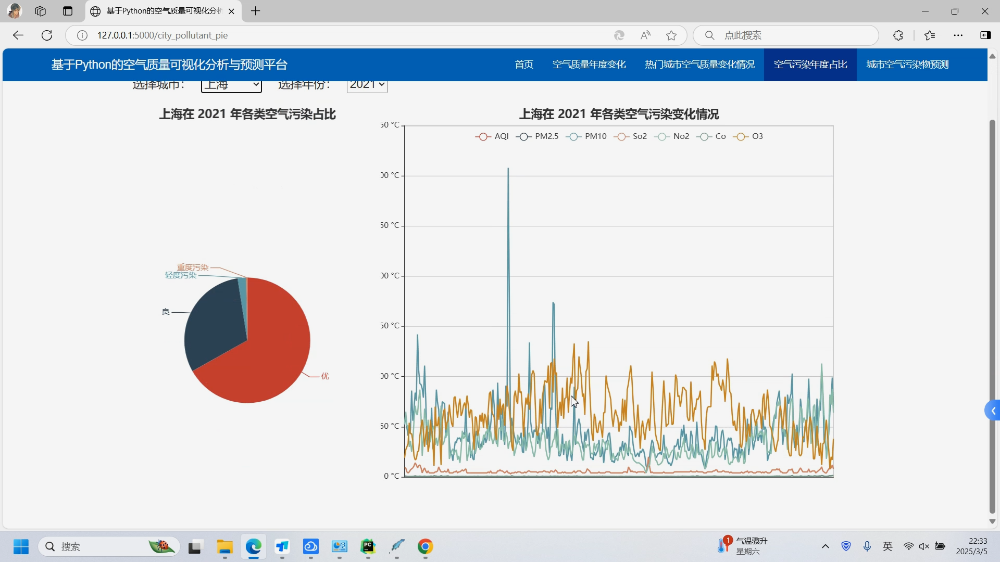
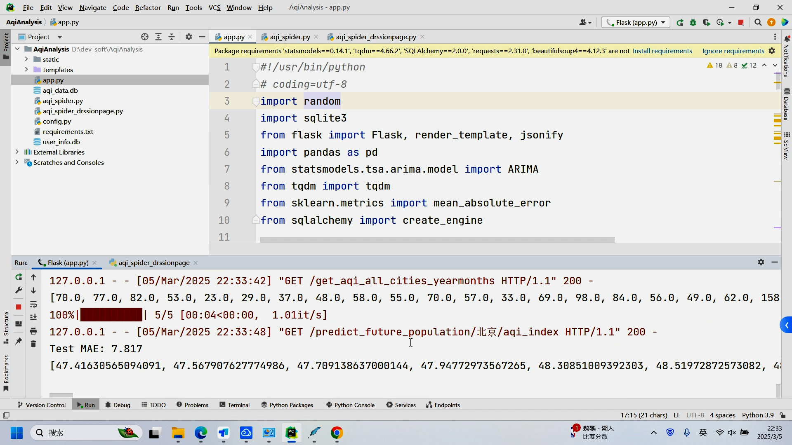
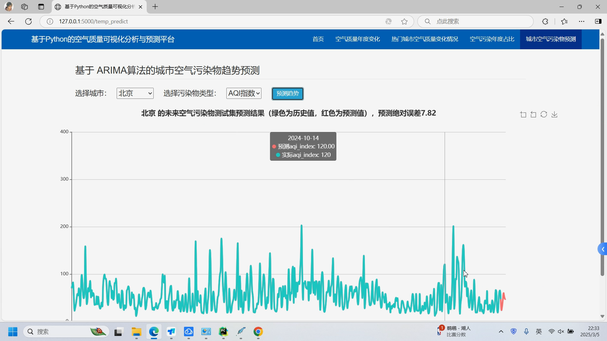
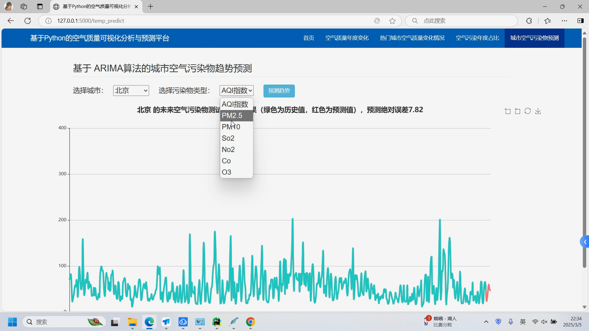
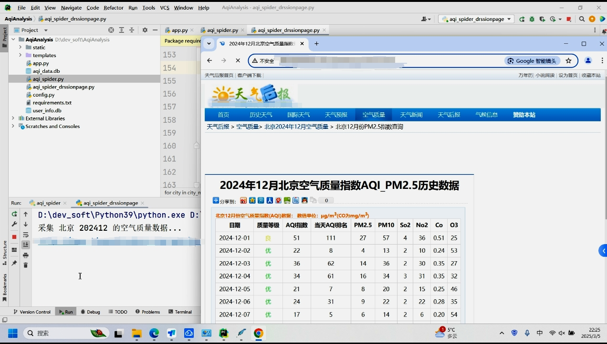

## 计算机毕业设计吊炸天Python+DeepSeek-R1大模型空气质量预测分析 空气质量可视化 空气质量爬虫  机器学习 深度学习 大数据毕业设计

## 要求
### 源码有偿！一套(论文 PPT 源码+sql脚本+教程)

### 
### 加好友前帮忙start一下，并备注github有偿空气质量预测
### 我的QQ号是2827724252或者798059319或者 1679232425或者微信:bysj2023nb 

# 

### 加qq好友说明（被部分 网友整得心力交瘁）：
    1.加好友务必按照格式备注
    2.避免浪费各自的时间！
    3.当“客服”不容易，repo 主是体面人，不爆粗，性格好，文明人。

​	
## 介绍
空气质量优劣程度与一个城市的综合竞争力密切相关,它直接影响到投资环境和居民健康,因此越来越受到政府和公众的关注。本项目利用网络爬虫从某空气质量监测网站抓取全国各大城市的历年空气污染数据（PM2.5,PM10,SO2,NO2,CO,O3），对全国各城市（空间维度）不同年度（时间维度）等维度进行空气污染物的统计分析，并利用 Echarts 进行可视化展示。

## 演示视频
https://www.bilibili.com/video/BV15x9oYfEV8/?spm_id_from=333.1387.homepage.video_card.click

## 演示截图

